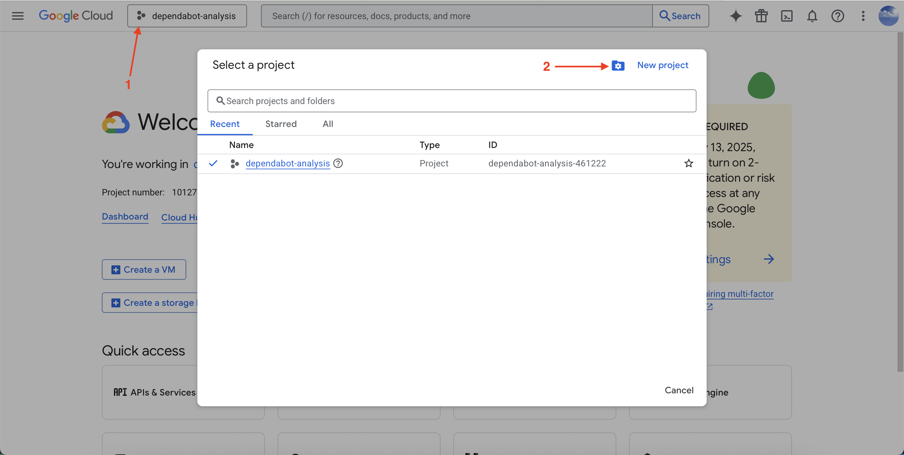

# Instructions pour la configuration de l’infrastructure Kubernetes et Cloud SQL

## Création du compte

1. Chaque membre de l’équipe doit demander un **coupon** pour bénéficier d’un crédit de **50 USD** en remplissant le formulaire suivant : [Lien](https://vector.my.salesforce-sites.com/GCPEDU?cid=RUfENThK1siA59ihpXrLq8YOgfYNGhMPEmF5lOBQfmsUzqp7SYS1NfEp7b0z%2F1Ue/).  
   L’équipe disposera ainsi d’un **crédit total de 150 USD**.

2. Vérifiez votre compte en cliquant sur le lien de confirmation envoyé dans le deuxième courriel.  
   Vous recevrez ensuite un autre courriel pour **appliquer le coupon**.  
   Vous pouvez utiliser votre **adresse Gmail** pour en bénéficier.

3. Pour vérifier si les crédits ont bien été appliqués, rendez-vous sur la page suivante : [Lien](https://console.cloud.google.com/billing/credits).

---

## Configuration de Kubernetes

Dans cette étape, nous allons configurer un **cluster Kubernetes** avec les ressources minimales nécessaires pour déployer nos applications.

### 1. Création du projet

Tout d’abord, créez un **projet GCP** qui contiendra toutes les ressources liées au laboratoire.  
Pour ce faire, allez sur la [page principale](https://console.cloud.google.com/welcome).  
Cliquez sur le bouton situé à gauche de la barre de recherche (comme illustré ci-dessous), puis sélectionnez **New project**.  
Choisissez un nom pour le projet (ex. : `log680-a2025-project`) et cliquez sur **Create**.



---

### 2. Installation de la CLI Google Cloud

Pour pouvoir créer un cluster depuis la ligne de commande, installez **gcloud** en suivant la [documentation officielle](https://docs.cloud.google.com/sdk/docs/install).

Vérifiez ensuite que l’installation a réussi :
```bash
gcloud --version
```

---

### 3. Authentification

Authentifiez-vous à votre compte GCP à l’aide de la commande suivante :
```bash
gcloud auth login
```
Une page web s’ouvrira pour vous permettre de vous connecter avec le **compte Gmail associé à votre projet GCP**.  
Une fois connecté, vous devriez voir le message suivant dans le terminal :
```
You are now logged in as [votre_compte_gmail].
```

---

### 4. Sélection du projet actif

Vérifiez que le **projet sélectionné** est bien celui que vous venez de créer.  
Utilisez l’**ID du projet** (et non son nom).  
Si nécessaire, sélectionnez-le avec la commande suivante :
```bash
gcloud config set project VOTRE_PROJECT_ID
```

---

### 5. Installation des dépendances

Installez les outils suivants :  
- **Helm** → [Documentation](https://helm.sh/docs/intro/install/)  
- **kubectl** → [Documentation](https://kubernetes.io/docs/tasks/tools/)

---

### 6. Création et configuration du cluster Kubernetes

Exécutez le script suivant :
```bash
sh ./create_k8s.sh [PROJECT] [REGION] [SERVICE_ACCOUNT_NAME]
```

**Paramètres :**
- `PROJECT` : ID du projet (**obligatoire**)  
- `REGION` : région où le cluster sera créé (**optionnel**, défaut : `us-central1`)  
- `CLUSTER_NAME` : nom du cluster (**optionnel**, défaut : `log680-gcp-cluster`)  
- `SERVICE_ACCOUNT_NAME` : nom du compte de service associé au cluster (**optionnel**, défaut : `kubernetes-engine-developer`)

---

### 7. Vérification du cluster

Pour vérifier l’installation du cluster et récupérer l’adresse IP publique de votre ingress :
```bash
kubectl get svc -n ingress-nginx
```
Cette adresse IP servira de **point d’accès** aux applications hébergées dans le cluster.  
Notez qu’il peut falloir **quelques minutes** avant qu’elle s’affiche.

Votre fichier **kubeconfig** se trouve par défaut :
- sous **Linux/MacOS** : `~/.kube/config`
- sous **Windows** : `C:\Users\VotreNom\.kube\config`

---

## Configuration de Cloud SQL (PostgreSQL)

Créez et configurez une instance PostgreSQL sur Cloud SQL à l’aide du script suivant :
```bash
sh ./create_cloudsql.sh [PROJECT] [REGION] [INSTANCE_NAME] [USER_DB] [PASSWORD]
```

**Paramètres :**
- `PROJECT` : ID du projet (**obligatoire**)  
- `REGION` : région de création (**optionnel**, défaut : `us-central1`)  
- `INSTANCE_NAME` : nom de l’instance PostgreSQL (**optionnel**, défaut : `my-postgres`)  
- `USER_DB` : nom d’utilisateur de la base de données (**optionnel**, défaut : `log680user`)  
- `PASSWORD` : mot de passe de l’utilisateur (**optionnel**, défaut : `log680user`)

---

## Étapes supplémentaires

### 1. Création du namespace Kubernetes

Créez le **namespace** de votre équipe en suivant les instructions du dépôt suivant :  
👉 [k8s-config-generator](https://github.com/aliarabat/k8s-config-generator)

---

### 2. Création de la base de données et des utilisateurs

Créez la base de données, le nom d’utilisateur et le mot de passe nécessaires pour vos applications (`metrics-api` et `MobilitySoft`) en suivant les instructions du dépôt :  
👉 [postgresql-db-generator](https://github.com/aliarabat/postgresql-db-generator)

---

### 3. Sauvegarde des informations de connexion

Sauvegardez les identifiants de connexion à votre base de données dans un **secret Kubernetes** :

```bash
kubectl create secret generic db-credentials \
    --from-literal=POSTGRES_HOST=[Adresse privée de votre instance PostgreSQL] \
    --from-literal=POSTGRES_DB=[Nom de votre base de données] \
    --from-literal=POSTGRES_USER=[Nom d’utilisateur] \
    --from-literal=POSTGRES_PASSWORD=[Mot de passe]
        -n [Nom de votre namespace Kubernetes] \
    --dry-run=client -o yaml | kubectl apply -f -
```

---

### ✅ Votre infrastructure est maintenant prête !

Vous disposez désormais d’un **cluster Kubernetes fonctionnel** et d’une **instance Cloud SQL PostgreSQL** prête à être utilisée par vos applications.